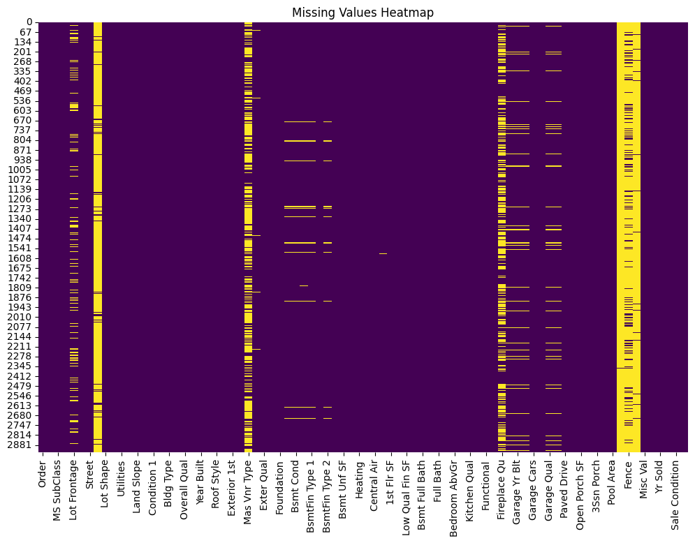
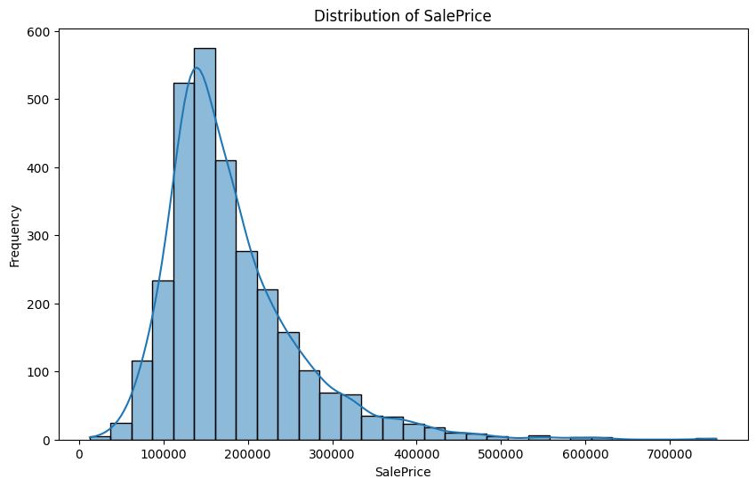
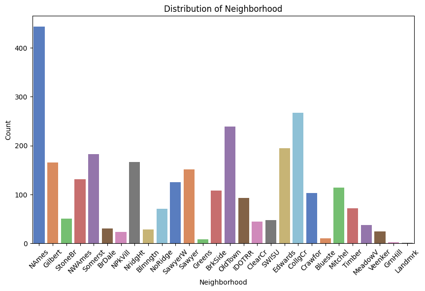
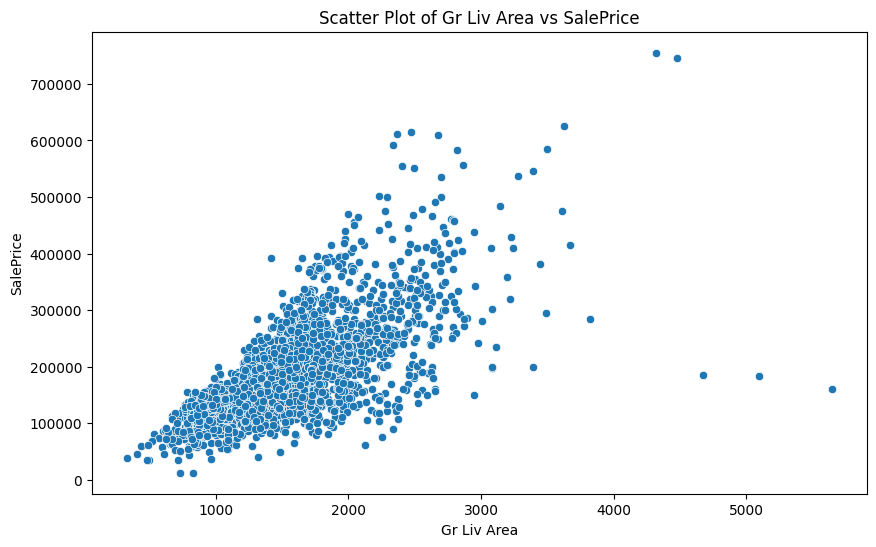
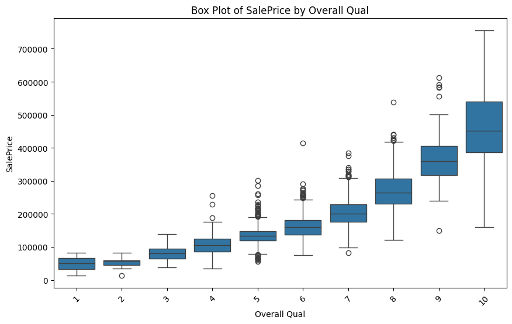
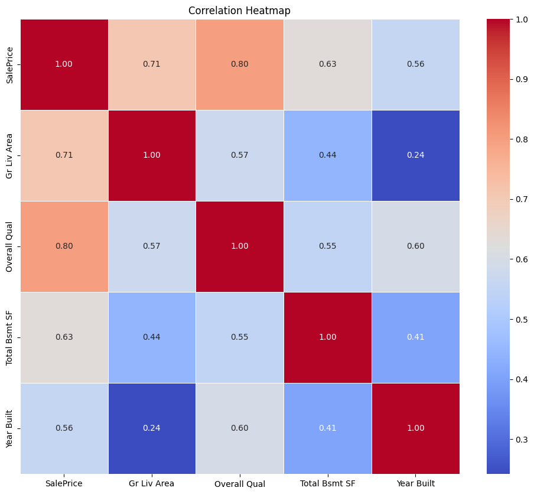
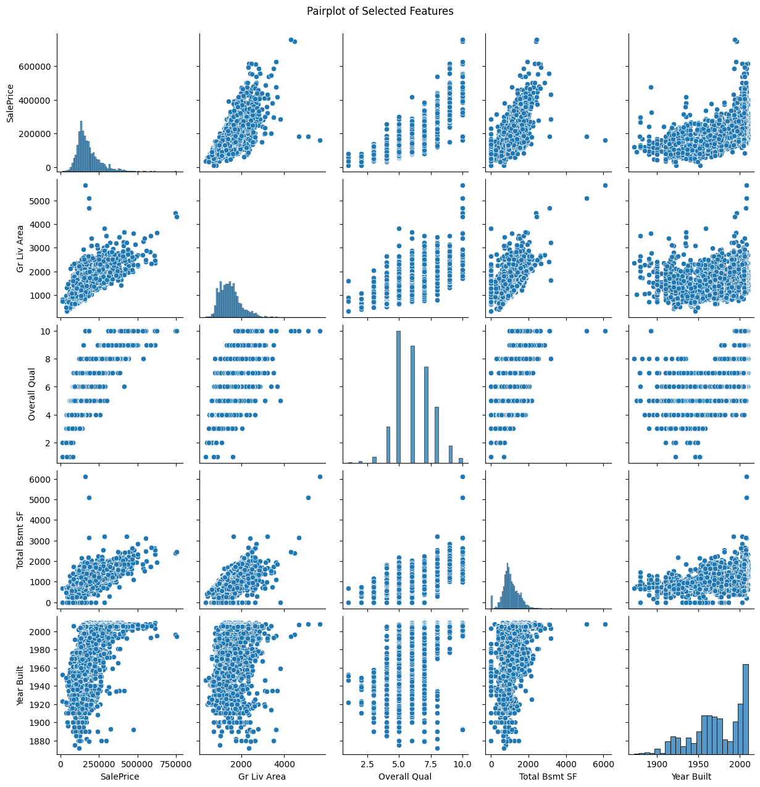

# Ames Housing Dataset Analysis

## Overview
This project performs a comprehensive exploratory data analysis (EDA) on the Ames Housing dataset, examining various features that influence house prices in Ames, Iowa.

## Dataset Information
- **Source**: AmesHousing.csv
- **Size**: 2,930 records with 82 features
- **Target Variable**: SalePrice

## Analysis Components

### 1. Basic Data Inspection
- Complete dataset with 2,930 rows and 82 features
- No duplicate records identified
- Data types and basic structure analyzed

### 2. Price Distribution
- **Mean Price**: $180,921.19
- **Median Price**: $160,000.00
- **Price Range**: $34,900 - $755,000
- **Standard Deviation**: $79,442.50

### 3. Key Findings

#### Neighborhood Analysis
Top 5 neighborhoods by number of houses:
1. Northridge Heights
2. Stone Brook
3. Clear Cr
4. Old Town
5. Brookside

#### Correlation Analysis
Strong correlations with Sale Price:
- Overall Quality (0.84)
- Ground Living Area (0.71)
- Total Basement Square Footage (0.61)
- Year Built (0.37)

### 4. Key Insights
1. **Quality Impact**: Overall quality shows the strongest correlation (0.84) with sale price, indicating it's the most influential factor
2. **Living Space**: Ground living area has a strong positive correlation (0.71), suggesting larger homes command higher prices
3. **Moderate Factors**: 
   - Basement size shows moderate correlation (0.61)
   - Year built has a weaker but positive correlation (0.37)

## Analysis Methods Used
- Basic Data Inspection
- Summary Statistics
- Missing Values Analysis
- Univariate Analysis (Numerical & Categorical)
- Bivariate Analysis
- Multivariate Analysis

## Technologies Used
- Python
- Pandas
- NumPy
- Seaborn (for visualization)
- Custom analysis modules implementing factory and template design patterns

## Project Structure
The analysis follows a structured approach using design patterns:
- Data Inspection Strategies
- Univariate Analysis
- Bivariate Analysis
- Multivariate Analysis
- Missing Values Analysis

## Key Visualizations

### Missing Values Distribution

*Distribution of missing values across the dataset*

### Price Distribution

*Distribution of house prices showing right-skewed pattern with most houses concentrated in the $100k-$200k range*

### Neighborhoods Distribution

*Neighborhood population distribution*

### Sale Price vs Gr Liv Area

*Sale price vs ground living area*

### Sale Price vs Overall Quality

*Sale price vs overall quality*

### Correlation Heatmap

*Correlation heatmap of the dataset*

### Pairplot

*Pairplot of selected features from thedataset*

